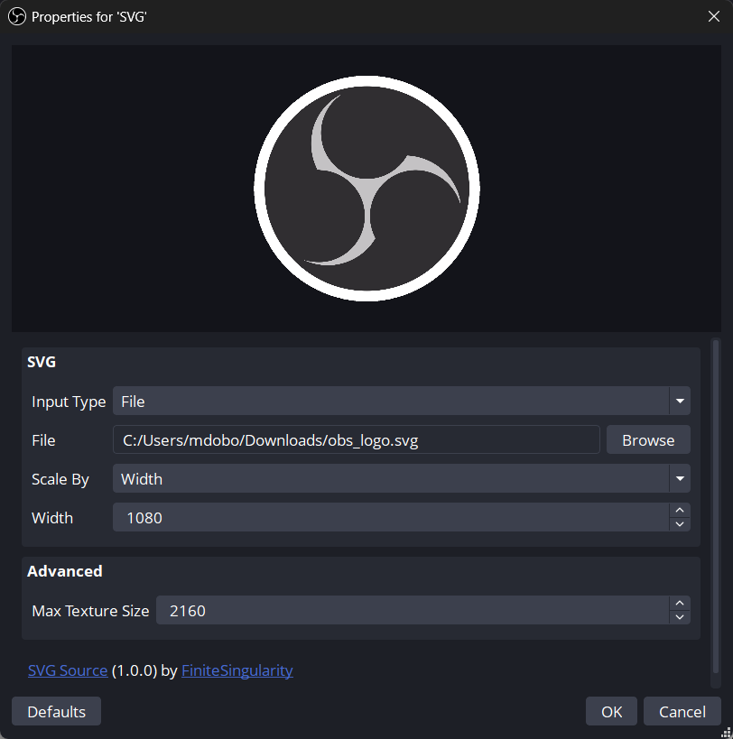

<!-- Title -->
# SVG Source Plugin for OBS

    <i align="center">Add scalable images to your OBS setup with SVG Source.</i>

<h4 align="center">
    
    
    
    
     
    
    
</h4>

> **Note**
> While we only release new versions of SVG Source after testing it on local hardware, there are bugs and issues that will slip through. If you happen to run into any issues, please [open an issue](https://github.com/finitesingularity/svg-source/issues) and we will work to resolve it.

## Introduction
An SVG (Scalable Vector Graphics) file is an XML-based image format that uses vector data to display crisp, resolution-independent graphics at any size. The SVG Source plugin adds native support for SVG files and text in OBS, letting you easily integrate scalable, dynamic graphics into your scenes.

- 📄 Allows for use of SVG files, and a text-based input where you can paste raw SVG data.
- 📏 Scale SVGs by width or height (maintaining aspect ratio) or scale by both.
- 🖥️ Specify a maximum generated texture size to either save memory, or create highly scalable images.

### Usage
After installing the SVG Source plugin, you will see a new source called "SVG" that can be added to your scenes. You will then see the following dialog:

- *Input Type:* Select if you want to provide an SVG file, or paste SVG XML text.
- *File:* File selector if you selected `File` above.
- *Text:* Text box for SVG XML text if you selected `Text` above.
- *Scale By:* Scale the source by width or height (preserving aspect ratio) or by both.
- *Width:* Width of the source in pixels (Shown if `Width` or `Both` selected above).
- *Height:* Height of the source in pixels (Shown if `Height` or `Both` selected above).
- *Max Texture Size:* The maximum dimension of the texture generated from the SVG. If you are not rescaling the SVG you can set this to the `Width` or `Height` value specified. If you are scaling the SVG (e.g.- using the Move plugin to resize it) set this to the maximum size you want to scale to (up to 10000 pixels).

Thank you for exploring the SVG Source plugin! Your feedback and contributions are highly appreciated as we continue to improve and expand this project.